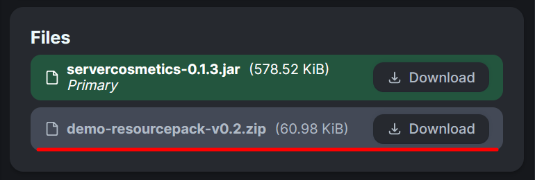

# Getting ServerCosmetics
Before we begin, we must download the mod or compile the mod.
## Downloading
Server Cosmetics can be found on [modrinth](https://modrinth.com/mod/server-cosmetics).

By default there will be demo cosmetics here, to see them you will need the resource pack, it should be as the primary file on modrinth:

Now you can proceed further!